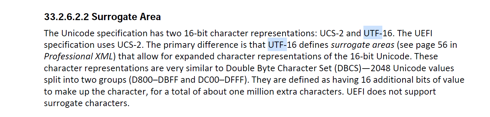

# Visual DOS-Tools for UEFI Shell
Create and debug DOS-Tools for UEFI Shell using Visual Studio 2022.

## Goal
Demonstration off how to implement DOS/UNIX software tools to access
the UEFI platform.

The projects are kept small and simple to introduce the UEFI shell
programming using "ANSI C", easily and quickly.

## Approach
It is intended to use Visual Studio 2022 as the only development environment.
Furthermore it is intended to use ANSI-C library functions as far as possible.

Doing so, the UEFI Shell applications can be easily debugged
on the Windows development platform, simply by building the sourcecode
as a Win64-executable (change the solution configuration from Efi64 to Win64 ).

## HowTo
https://github.com/KilianKegel/HowTo-setup-an-UEFI-Development-PC#howto-setup-an-uefi-development-pc


# Using UEFI- and Standard-C-API in shell applications, creating MSDOS Tools for UEFI

NOTE: The text below was originally published at the [tianocore/edk2-staging](https://github.com/tianocore/edk2-staging/tree/CdePkg/blogs/2021-11-28#using-uefi--and-standard-c-api-in-shell-applications-creating-msdos-tools-for-uefi)

### Table of content
* [Abstract](README.md#Abstract)
* [Introduction](README.md#Introduction)
    * [introductory email](https://edk2.groups.io/g/devel/topic/cdepkgblog_2021_11_18/87363412?p=,,,20,0,0,0::recentpostdate/sticky,,,20,2,0,87363412,previd=1638131716272402469,nextid=1637941879803363607&previd=1638131716272402469&nextid=1637941879803363607)
* [In a nutshell: `FIND.EFI`](README.md#in-a-nutshell-findefi)
* [Building: `FIND.EFI`](README.md#building-findefi)
* [Internal Processing: FIND.C](README.md#internal-processing-findc)
    * [Limitation parameter order](README.md#limitation-parameter-order)
    * [Finding file(s) to be processed](README.md#finding-files-to-be-processed)
    * [Dealing with ASCII and UCS2/UTF16LE file format](README.md#dealing-with-ascii-and-ucs2utf16le-file-format)
    * [Reading lines from `stdin`](README.md#reading-lines-from-stdin)
        * [1. stdin is directly connected to the console](README.md#1-stdin-is-directly-connected-to-the-console)
        * [2. stdin is redirected, BOM is not detected](README.md#2-stdin-is-redirected-bom-is-not-yet-detected)
        * [3. stdin is redirected, BOM is detected](README.md#3-stdin-is-redirected-bom-is-detected)
    * [Reading lines from file(s)](README.md#reading-lines-from-files)
* [In a nutshell: `MORE.EFI`](README.md#in-a-nutshell-morefi)
* [Building: `MORE.EFI`](README.md#building-moreefi)
* [Internal Processing: MORE.C](README.md#internal-processing-morec)
* [Retrospective CdePkgBlog 2021-11-14](README.md#retrospective-cdepkgblog-2021-11-14)
* [Coming up soon](README.md#coming-up-soon)

## Abstract
Demonstration on how to re-create and port software tools
that run in UEFI Shell, Microsoft Windows and Linux too and take benefit of the portability 
given by the standardization of the C language, using the latest development environment from Microsoft and the *open source*, *monolithic*, *multi-target* 
[**toro C Library**](https://github.com/KilianKegel/toro-C-Library#toro-c-library-formerly-known-as-torito-c-library)

NOTE: All statements regarding implementation specific details of **toro C Library** are always strictly focused on
my observations of Microsoft C Library, running "C" locale, at UTC timezone. Refering to Standard/ANSI C might be a 
Microsoft specific implementation of the specification. But I always give my best to double check the statements on GCC x64. In critical cases
also old Borland, Watcom and Digital Mars C compiler and library were queried. **toro C Library** is engineered -- not "scientifized".
This is also true for all upcoming CdePkgBlogs.

## Introduction

In this blog I'd like to introduce software tools written in pure [Standard/ANSI C](http://www.torek.net/torek/c/index.html), 
without any direct interaction with the operating system or direct hardware access. 

I chose a simple command line tool `FIND.EXE`. As far as I know `FIND.EXE` is an original MSDOS external command, 
since it does not belong to CP/M. `find` in UNIX/Linux has a different approach. For UNIX/Linux `grep` 
seems to be most similar to `FIND.EXE`, but more powerful.

Afterwards the `more` command will be discussed. Its missing has been permanently irritating me during the past decade when using UEFI Shell,
since the PAGEUP scroll back capabilities are limited, and UEFI Shell command `DMPSTORE` only works sufficently
combined with `more`. `more` (truly **toro C Clibary** specific implementation) significantly improves CTRL-C break,
that is processed only on variable boundries in `DMPSTORE`.

This blog shall encourage engineers to start porting tools from MSDOS
to the UEFI Shell, like `fdisk`, `format`, `sort`, `debug`, `choice`, `fc`, `tree`
and a real `mode` .

 `grep`  and some other UNIX/Linux tools were already ported a couple of years ago by Andrei Warkentin: <br>
https://github.com/andreiw/UefiToolsPkg/tree/master/Applications/grep

# In a nutshell: `FIND.EFI`

`FIND.EFI` is a simple tool that searches `search string` line wise in a file.<br>
The file can be either one or more file(s) or `stdin`. Both are accepted in ASCII- and in UTF16LE mode.<br>
The operation can be parametrized to search:<br>
* case insensitive
* precede the line number to match
* inverted search - exclude lines that doesn't contain `search string`
* count matches only
```
    Searches for a text string in a file or files or in STDIN

    FIND "string" [/V][/C][/N][/I] [[drive:][path]filename[...]]

      "string"   Specifies the text string to find. It must be the first parameter
      /V or /v   Displays all lines NOT containing the specified string.
      /C or /c   Displays only the count of lines containing the string.
      /N or /n   Displays line numbers with the displayed lines.
      /I or /i   Ignores the case of characters when searching for the string.
      [drive:][path] filename
                 Specifies a file or files to search.

    If a path is not specified, FIND searches the text typed at the prompt
        or piped from another command.
```

This `FIND` implementation uses the first parameter (`argv[1]`) <INS>*always*</INS> as the `"search string"`,
except in case `argv[1]` is `/?`.
The cause is explained below. Afterwards `FIND` tries to find the switches, always beginning with a slash `/`-charcter.
All other parameters are filenames, to be processed.

If not at least one single filename is given, `FIND` uses `stdin` instead. That could be a redirected file output using the shell's pipe operator `|` or `|a` 
or a direct console input.

## Building: `FIND.EFI`
`FIND.EFI` is created in the VS2022CLI box. <br>
To start this, please refer to https://github.com/tianocore/edk2-staging/tree/CdePkg/blogs/2021-11-14#starting-visual-studio-2022 <br>

It is created out of one single file of sourcecode: [`FIND.C`](find.c).

If you want to build `FIND.EFI` only, and not its Windows-versions, just type:<br>
`cl /nologo /GS- /D_NO_CRT_STDIO_INLINE /D_CRT_SECURE_NO_WARNINGS find.c /link /NODEFAULTLIB /ENTRY:_cdeCRT0UefiShell /SUBSYSTEM:EFI_APPLICATION /out:find.efi lib\toroC64.lib`

Otherwise <br>
1. you want to create the **toro C Library** Windows version, link:<br>
   `link /nologo /NODEFAULTLIB /ENTRY:_cdeCRT0WinNT /SUBSYSTEM:console /out:find.exe find.obj lib\toroC64.lib kernel32.lib`<br>
2. you want to create the **Microsoft LIBCMT.lib** Windows version, link:<br>
   `link /nologo /SUBSYSTEM:console /out:findMsft.exe find.obj`<br>
3. you want to create a Linux/ELF64 version, just invoke the Linux C compiler in [UEFI-Development-PC with WSL](https://github.com/KilianKegel/HowTo-setup-an-UEFI-Development-PC#16-install-windows-subsystem-for-linux-wsl2--ubuntu-2004)<br>
   `wsl cc find.c`

## Internal processing: FIND.C
### Limitation parameter order
Using Standard/ANSI C only there appears to be a problem in transferring the `"search string"` to the `main()`-function.

Since in its original Microsoft Windows-version `"search string"` can be placed in any order  with the other parameters,
<ins>it has to be the first one</ins> in this *portable Standard/ANSI C implemenation*.<br>

The reason is very simple:<br>
The enclosing quotation marks prevent the scanner from splitting at space characters. Parts of the commandline inside `""` 
gets one single `argv[]`; inside `main()` the `""` quotation marks are not visible.<br>
https://docs.microsoft.com/en-us/cpp/c-language/parsing-c-command-line-arguments<br>

In **toro C Library** that corresponding function is called [`_cdeStr2Argcv()`](_cdeStr2Argcv.c).

Since this piece of source code runs when linking **toro C Library** for Windows and for UEFI Shell,
its correctness was proven in the Windows command line and compared to a original Microsoft LIBCMT.LIB build with  many different test patterns.

### Finding file(s) to be processed
The files to be processed are checked [here](find.c#L124)
```c
[122]  do {
[123]      //
[124]      // check, if filename is passed in the commandline. If not, read from file instead from STDIN
[125]      //
[126]      if (0 < cntFile ) {                                                 // take filename from commandline
[127]          if (!IsFile(argv, iargv))
[128]              continue;
[129]          if (NULL == (fp = fopen(argv[iargv], "r"))) {
[130]              fprintf(stderr, "File not found - %s\n", argv[iargv]);      // file is not present...
[131]              exit(1);
[132]          }
```
In case real filename(s) are passed in the command line each filename
is used to [open the file](find.c#L129).

If not so, [``` FILE* fp = stdin```](find.c#L44) is initialized at definition
and `stdin` will be used instead.

### Dealing with ASCII and UCS2/UTF16LE file format

UEFI specifies ASCII and UCS2 format for characters.




In Files ASCII vs. UCS2 differentiation is done by a [**byte order mark/BOM**](https://en.wikipedia.org/wiki/Byte_order_mark)
with a value of 0xFEFF.

```c
[145]
[146]   if (2 <= fsize)
[147]   {
[148]       unsigned short BOM;
[149]
[150]       fread(&BOM, 2, 1, fp);
[151]
[152]       fUTF16 = (0xFEFF == BOM);
[153]
[154]       if(0 == fUTF16)
[155]           rewind(fp);
[156]
[157]   }
[158]
```

In case the `BOM` is not found, the file index needs to be set to 0 to get the first two ASCII characters
from the text file.

### Reading lines from `stdin`
When getting the lines from `stdin` this differentiation is not needed,
since in the **toro C Library** implementation `stdin` internally always provides ASCII-format only.
##### NOTE: Wide functions based on `fgetwc()` just stretch single byte characters to wide size. Getting true UTF16LE access to files needs additional, non-standard `fopen()` flags, that are not yet available in **toro C Library**: https://docs.microsoft.com/en-us/cpp/c-runtime-library/reference/fopen-wfopen?view=msvc-170#unicode-support

There are three different cases,  handled internally/automatically by the *operating system interface (`osif`)*
[`osifUefiShellFileRead()`](https://github.com/tianocore/edk2-staging/blob/CdePkg/blogs/2021-11-28/osifUefiShellFileRead.c)


#### 1. `stdin` is directly connected to the console
```c

[52]    #define OPENMODE pCdeFile->openmode

[55]
[56]    if (OPENMODE & O_CDESTDIN)
[57]    {
[58]        static wchar_t wcbuffer[BUFSIZ];/* BUFSIZ can not be changed on STDIN */
[59]    
[60]        if (0 == (OPENMODE & O_CDEREDIR))
[61]        {// keyboard is connected directly, BOM is NOT transmitted, terminated by users's ENTER, but this ENTER is not transmitted
[62]    
[63]            BufferSize = (nelem - 2/*reserve space for CRLF */) * 2;
[64]    
[65]            Status = __cdeOnErrSet_status(pCdeFile->pRootProtocol->Read(pCdeFile->pFileProtocol, &BufferSize, &wcbuffer[0]));
[66]    
[67]            if (EFI_SUCCESS != Status)
[68]                break;
[69]    
[70]            for (i = 0; i < BufferSize / 2; i++)
[71]                pBuffer[i] = (char)wcbuffer[i];
[72]    
[73]            pBuffer[i + 0] = '\r';
[74]            pBuffer[i + 1] = '\n';
[75]    
[76]            BufferSize = BufferSize / 2 + 2/* CRLF */;
[77]        }
[78]    
 ```
 `if (0 == (OPENMODE & O_CDEREDIR))` (line 60 in the listing above) checks if `stdin` is redirected (that was detected while running through `CRT0()` )

`EFI_FILE_PROTOCOL.Read()` returns the keys pressed on the keyboard until ENTER as a string of wide characters, placed in `wcbuffer[]`.<br>
ENTER itself is *not* transmitted.

After converting the wide character string to an ASCII string (line 70 in the listing above), CR and LF were appended (line 73, 74 in the  listing above) to the string
and afterwards hand over back to `fread()`.

#### 2. `stdin` is redirected, BOM <ins>is not yet</ins> detected
```c

[52]    #define OPENMODE pCdeFile->openmode

[80]
[81]    if (0 == (OPENMODE & O_CDEDETECTED))
[82]    {
[83]       size_t BufferSizeBOM = 2;
[84]       //
[85]       // read first TWO bytes and detect if it is BOM == 0xFEFF, if yes 16bit input, otherwise ASCII
[86]       //
[87]       wcbuffer[0] = 0;
[88]       Status = __cdeOnErrSet_status(pCdeFile->pRootProtocol->Read(pCdeFile->pFileProtocol, &BufferSizeBOM, pwcBuffer/* == pBuffer */));
[89]       if (EFI_SUCCESS != Status)
[90]           break;
[91]
[92]       if (pwcBuffer[0] == BOM)/* == pBuffer[0..1] */
[93]       {
[94]           OPENMODE |= O_CDEDETECTED + O_CDEWIDTH16;
[95]
[96]           BufferSize = nelem * 2;
[97]           Status = __cdeOnErrSet_status(pCdeFile->pRootProtocol->Read(pCdeFile->pFileProtocol, &BufferSize, &wcbuffer[0]));
[98]
[99]           if (EFI_SUCCESS != Status)
[100]               break;
[101]
[102]           for (i = 0; i < BufferSize / 2; i++)
[103]               pBuffer[i] = (char)wcbuffer[i];
[104]
[105]           BufferSize = BufferSize / 2;
[106]       }
[107]       else {
[108]
[109]           OPENMODE |= O_CDEDETECTED;
[110]
[111]           BufferSize = nelem - 2/* two bytes already read */;
[112]           Status = __cdeOnErrSet_status(pCdeFile->pRootProtocol->Read(pCdeFile->pFileProtocol, &BufferSize, &pBuffer[2/* two bytes already read */]));
[113]
[114]           if (EFI_SUCCESS != Status)
[115]               break;
[116]           BufferSize += 2;/* two bytes already read */;
[117]       }
[118]   }
```
When the application requests the *first* access to a `stdin` that is redirected from a file, and
its width is not yet detected `(0 == (OPENMODE & O_CDEDETECTED)`, the source above is applied.

`EFI_FILE_PROTOCOL.Read()` gets the first two bytes and `O_CDEWIDTH16` is set to `OPENMODE`
depending on their value:
```c
[92]       if (pwcBuffer[0] == BOM)/* == pBuffer[0..1] */

[94]            OPENMODE |= O_CDEDETECTED + O_CDEWIDTH16;

[109]           OPENMODE |= O_CDEDETECTED;
```

After detection of width the internal buffer could be filled fully.<br>
**NOTE:** <ins>All</ins> file/stream accesses are *buffered* in C, even if `_IONBF` is set. In that case buffer size is 
just reduced to hold `\r\n`. <br><br>
<ins>Independant of the number of bytes requested by `fread()`/`fwrite()` internally all
OS-reads/writes were done *buffer-size-wise*. This is fundamental for Standard C and simply called **"buffered I/O"**</ins>

#### 3. `stdin` is redirected, BOM <ins>is</ins> detected
```c
[81]    if (0 == (OPENMODE & O_CDEDETECTED))
[82]    {

[118]   }
[119]   else {
[120]       if (O_CDEWIDTH16 == (OPENMODE & O_CDEWIDTH16)) {
[121]           BufferSize = nelem * 2;
[122]           Status = __cdeOnErrSet_status(pCdeFile->pRootProtocol->Read(pCdeFile->pFileProtocol, &BufferSize, &wcbuffer[0]));
[123]   
[124]           if (EFI_SUCCESS != Status)
[125]               break;
[126]   
[127]           for (i = 0; i < BufferSize / 2; i++)
[128]               pBuffer[i] = (char)wcbuffer[i];
[129]   
[130]           BufferSize = BufferSize / 2;
[131]   
[132]       }
[133]       else {
[134]           BufferSize = nelem;
[135]           Status = __cdeOnErrSet_status(pCdeFile->pRootProtocol->Read(pCdeFile->pFileProtocol, &BufferSize, &pBuffer[0]));
[136]   
[137]           if (EFI_SUCCESS != Status)
[138]               break;
[139]       }
[140]   
[141]   }
```
In case of `O_CDEWIDTH16` the `EFI_FILE_PROTOCOL.Read()` fills the `wcbuffer` with UTF16LE words that needs to
be shrunk to ASCII again (line 127, 128 in the listing above).

Otherwise `EFI_FILE_PROTOCOL.Read()` transfers directly to the internal 'stdin' buffer space (line 135).

### Reading lines from file(s)
Standard C provides the function [`fgets()`](https://docs.microsoft.com/en-us/cpp/c-runtime-library/reference/fgets-fgetws?view=msvc-170&viewFallbackFrom=vs-2019) 
to read line-wise from a stream. A line is terminated by a new line character `'\n'`.
In **toro C Library** this function is implemented that way: [fgets.c](fgets.c)

As already mentioned [above](README.md#note-wide-functions-based-on-fgetwc-just-stretch-single-byte-characters-to-wide-size-getting-true-utf16le-access-to-files-needs-additional-non-standard-fopen-flags-that-are-not-yet-available-in-toro-c-library-httpsdocsmicrosoftcomen-uscppc-runtime-libraryreferencefopen-wfopenviewmsvc-170unicode-support)
it makes no sense to use the wide version `fgetws()` here. 

Instead `fgets()` could be used to read until new line. 
The wide (UTF16-LE) strings needs a small number of additional processing:
1. the buffer must be cleared to ZERO, since a wide string is terminated by a `(whar_t)'\0'`, but `fgets()` terminates with a [`(char)'\0'`](fgets.c#L67) only.<br>
    (lines 165, 220)<br>
2. The UTF16-LE characters have to be shrunk manually. (`while`-loop line 186-191)<br>
    **ATTENTION:** `wchar_t` is 16 bit wide on Microsoft platforms/compilers. On GNU/Linux it is 32 bit in size: http://www.firstobject.com/wchar_t-string-on-linux-osx-windows.htm <br>
    Therefore type `short`is used instead of `wchar_t`. `short`is the same size in Linux and Windows.


```c
[165]   memset(pLineOrg, 0, MAXLINELEN);
[166]   while (NULL != fgets(pLineOrg, MAXLINELEN, fp))
[167]   {
[168]       int equality = (0 == parm[V]) || (0 == stringlen && 0 != parm[V]) ;
[169]       int match;
[170]       line++;
[171]   
[172]       //
[173]       // convert wide character string (wcs) to string (str)
[174]       //
[175]       if (1 == fUTF16) {
[176]           int x = 0;
[177]           char c;
[178]   
[179]           //don't work for LINUX:
[180]           //
[181]           // wcstombs(pLineOrg, (wchar_t*)pLineOrg, MAXLINELEN);
[182]           //
[183]           //  wchar_t size in Linux i 4, in Windows 2:
[184]           //  http://www.firstobject.com/wchar_t-string-on-linux-osx-windows.htm
[185]   
[186]           while (
[187]               c = pLineOrg[x * sizeof(short)],
[188]               pLineOrg[x * sizeof(char)] = c,
[189]               x++,
[190]               c != '\0'
[191]           );
[192]           fgetc(fp);      // adjust file index to next UTF16-LE character,
[193]                           // get high-part of UTF16-LE from '\n'
[194]       }

[220]       memset(pLineOrg, 0, (linelen + 1) * sizeof(wchar_t));   // clear old buffer before reading next line
[221]   }
```

# In a nutshell: `MORE.EFI`
`MORE.EFI` lists a text-file content page-wise on the screen.
the `more` command also exists on Windows and UNIX/Linux systems. 
Surely it has its origin on the latter.

Even like `FIND.EFI` it accepts file names given in the command line, otherwise `stdin` is in charge.

This `MORE.EFI` is a minimal-implementation that doesn't have any other parameters.
It does not even check when `stdout` is redirected to a file and the key-press would not have been required.
It does also not check the length of a line, so if a wrap around occurs, one line on top of the screen is gone.


## Building: `MORE.EFI`
`MORE.EFI` is created in the VS2022CLI box. <br>
To start this, please refer to https://github.com/tianocore/edk2-staging/tree/CdePkg/blogs/2021-11-14#starting-visual-studio-2022 <br>

It is created out of one single file of sourcecode: [`MORE.C`](more.c).

If you want to build `MORE.EFI` just type:<br>
`cl /nologo /GS- /D_NO_CRT_STDIO_INLINE /D_CRT_SECURE_NO_WARNINGS /IMdePkgInc /IMdePkgInc\X64 more.c /link /NODEFAULTLIB /ENTRY:_cdeCRT0UefiShell /OUT:more.efi /SUBSYSTEM:EFI_APPLICATION lib\toroC64.lib`

## Internal processing: MORE.C
**toro C Library** is designed for primarily for UEFI.<br>
To enable that *really beautiful, really elegant* UEFI API accesses using the `SystemTable`
directly in the source code, **toro C Library**-based Standard C programs need `SystemTable` 
and `ImageHandle` (`FileHandle` for PEI) passed on a sideway, that keeps the buildability of 
the source code also for non-UEFI executables. Therefore there is no need for an additional non-Standard-C-Library function 
(e.g. `_CdeGetSystemTable()`).<br>
I chose to extend the argument vector `argv[]` into the negative range:
* `argv[-1]`: `SystemTable` or `PeiServices `
* `argv[-2]`: `ImageHandle` or `FileHandle`

In the `more.c` source code below  `SystemTable` and `ImageHandle`were retrieved in line 17 and 18 in the source listing below.

To get number of lines `QueryMode()` is invoked in line 26, using a call into the `SystemTable`.

From lines 36 to 50 the [file/`stdin`](README.md#finding-files-to-be-processed) and 
[ASCII/UTF16](README.md#dealing-with-ascii-and-ucs2utf16le-file-format) detection is done in a similiar way as with `FIND.C`

The entire stream is retrieved and simultaneously converted to ASCII representation during lines 56 and 67.
The buffer size is continuously increased byte by byte using the `realloc()` Standard C function. In case of an allocation error
the process is just `abort()`-ed.

Once, the screen is fully filled with lines, `MORE` awaits a key to be pressed. Usually
a function called `kbhit()` is in charge. Regrettably `kbhit()` is not a member
of the Standard C Library and not available in **toro C Library**.
Lines 79 to 82 do the same on UEFI API basis.

```c
[1]     //
[2]     // MSDOS/Windows/UNIX MORE command for UEFI Shell
[3]     //
[4]     //  Copyright(c) 2017 - 2021, Kilian Kegel.All rights reserved.
[5]     //  SPDX - License - Identifier: BSD-2-Clause-Patent
[6]     //
[7]     
[8]     #include <stdio.h>
[9]     #include <stdlib.h>
[10]    #include <string.h>
[11]    #undef NULL
[12]    #include <uefi.h>
[13]    
[14]    #define ELC(x) ( sizeof(x) / sizeof(x[0]) )                         // element count
[15]    
[16]    int main(int argc, char** argv) {
[17]        EFI_SYSTEM_TABLE* pEfiSystemTable = (void*)(argv[-1]);          // pEfiSystemTable is passed in argv[-1]
[18]        EFI_HANDLE* hEfiImageHandle = (void*)(argv[-2]);                // ImageHandle is passed in argv[-2]
[19]        UINTN Cols, Rows, Line = 0;                                     //
[20]        int c, i, n = 1, idiv = 1;                                      //
[21]        char* pBuf, * p;                                                //
[22]        FILE* fp = stdin;                                               // take file from STDIN, by default
[23]        char fUTF16 = 0;                                                // flag file format
[24]        int nRet = EXIT_SUCCESS;
[25]    
[26]        pEfiSystemTable->ConOut->QueryMode(                             // get number of text lines of the screen
[27]            pEfiSystemTable->ConOut,
[28]            (UINTN)pEfiSystemTable->ConOut->Mode->Mode,
[29]            &Cols, &Rows
[30]        );
[31]    
[32]        do {
[33]            //
[34]            // check, if filename is passed in the commandline. If so, read from file instead from STDIN
[35]            //
[36]            if (argc > 1) {                                             // take filename from commandline
[37]                if (NULL == (fp = fopen(argv[n], "r"))) {               // open filename from commandline
[38]                    fprintf(stderr, "Cannot access file %s\n", argv[n]);// file is not present...
[39]                    nRet = EXIT_FAILURE;                                // set exit code
[40]                    break;                                              // ...exit program
[41]                } else {                                                // detect file format
[42]                    //
[43]                    // check BOM byte order mark UTF-16 (LE) https://en.wikipedia.org/wiki/Byte_order_mark#UTF-16
[44]                    //
[45]                    unsigned short BOM = 0;
[46]                    fread(&BOM, 2, 1, fp);
[47]                    fUTF16 = (0xFEFF == BOM);
[48]                    if (0 == fUTF16)
[49]                        rewind(fp);
[50]                }
[51]            }
[52]    
[53]            //
[54]            // read from file/STDIN until EOF to continously enlarged buffer
[55]            //
[56]            idiv = fUTF16 ? 2 : 1;                                      // adjust idiv to decide skip zero high byte
[57]            pBuf = NULL;                                                // inital request for realloc()
[58]            for (i = 0 ; EOF != (c = fgetc(fp)); i++) {                 // read character from file/STDIN until EOF
[59]                if(fUTF16)                                              // if UTF16 file format...
[60]                    if (0 != (i % 2))                                   // ... if zero high byte...
[61]                        continue;                                       // ... skip that byte and continue
[62]                pBuf = realloc(pBuf, i / idiv + 1);                     // allocate buffer / increase buffersize
[63]                if (NULL == pBuf)                                       // check allocation failure...
[64]                    abort();                                            // ...abort(), if so
[65]                pBuf[i / idiv] = (char)c;                               // store character in memory buffer
[66]            }                                                           //
[67]            pBuf[i / idiv] = '\0';                                      // set string termination
[68]    
[69]            //
[70]            // Buffer contains the entire file now. Print file line-wise to the screen and stop after # rows and wait for key
[71]            //
[72]            for (Line = 0, p = strtok(pBuf, "\n"); p != NULL; Line++)   // display the text screen wise
[73]            {
[74]                if (Rows == 1 + Line) {
[75]                    UINTN Index;
[76]                    EFI_INPUT_KEY Key;
[77]                    EFI_STATUS Status;
[78]                    printf("-- More --");
[79]                    do {                                                // read real kbhit(), since STDIN is redirected
[80]                        pEfiSystemTable->BootServices->WaitForEvent(1, pEfiSystemTable->ConIn->WaitForKey, &Index);
[81]                        Status = pEfiSystemTable->ConIn->ReadKeyStroke(pEfiSystemTable->ConIn, &Key);
[82]                    } while (EFI_SUCCESS != Status);
[83]                    printf("\n");
[84]                    Line = 0;
[85]                }
[86]                printf("%s\n", p);                                      // print the text line
[87]                p = strtok(NULL, "\n");                                 // get the next text line
[88]            }
[89]            if(stdin != fp)
[90]                fclose(fp);                                             // close fp, that was opened above
[91]        } while (++n < argc);                                           // next file...
[92]    
[93]        return nRet;
[94]    }
```

## Revision history
https://github.com/KilianKegel/torito-C-Library#revision-history
### 20220507
* update/improve `find`, `more` to support both 8+16Bit `stdin`
* add program documentation
### 20220502
* update to **TORO C Library** *20220502*
### 20211101
* update to **TORO C Library** *20211031*
### 20210825
* Update to Microsoft Visual Studio Community 2022 Preview (64-bit), Version 17.0.0 Preview 3.1
### 20210820/R166
* Update to torito-C 20210820/R166
### 20200204/R154
* Update to torito-C 20200204/R154
* adjust solution configurations
* update copyright
### 20191018/R141
* update Torito C Library https://github.com/KilianKegel/torito-C-Library#20191017r141
### 20190922
* add FIND command
* Update to torito-C 20190621/R138 that autodetects I/O redirection UTF16 vs. ASCII
* add support for VS2019 ver 16.2.5
### 20190621
* improve MORE command, added command line parameter
* Update to torito - C 20190621 / R133 that adds VS2019 support, remove library dependancy from compiler version
### 20181129/R116
* Update to torito-C 20181129/R116 that provides various improvements
### 20181112/R110
* Update to torito-C 20181112/R110 that provides scanf-family improvements
### 20180921/R107
* Update to torito-C 20180920/R106 that provides VS2017/15.8 support
* cleanup project settings, remove default C library from solution/project view
### 20180831
* initial revision -> the MORE command

